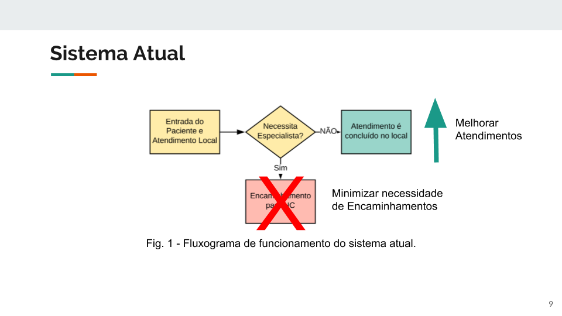
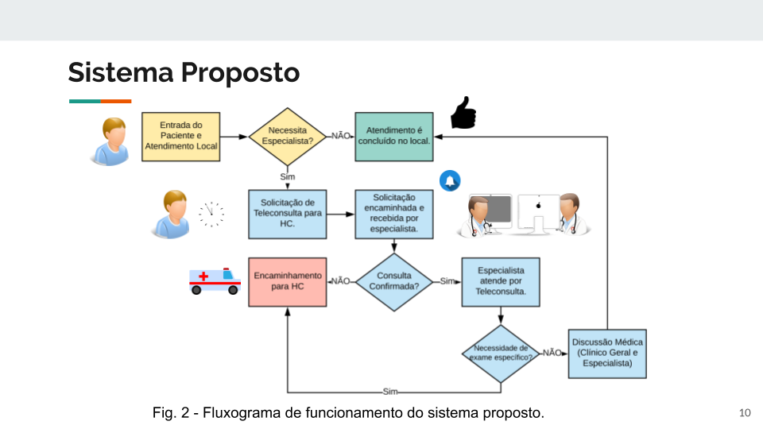
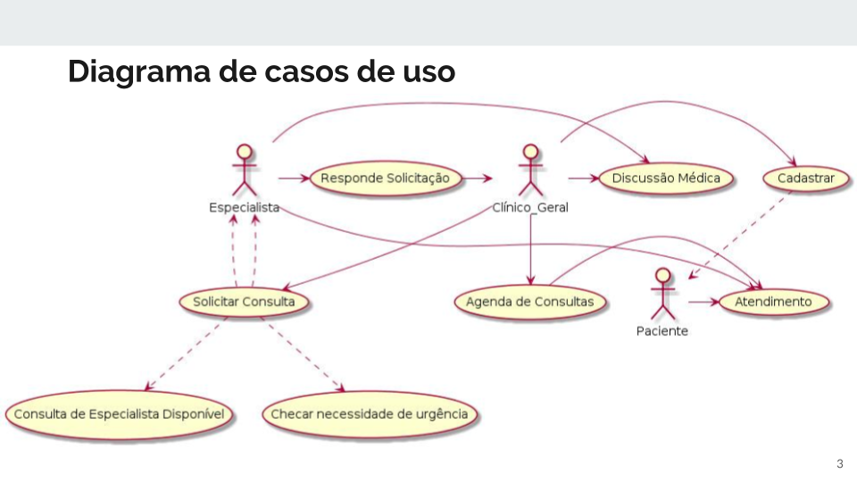
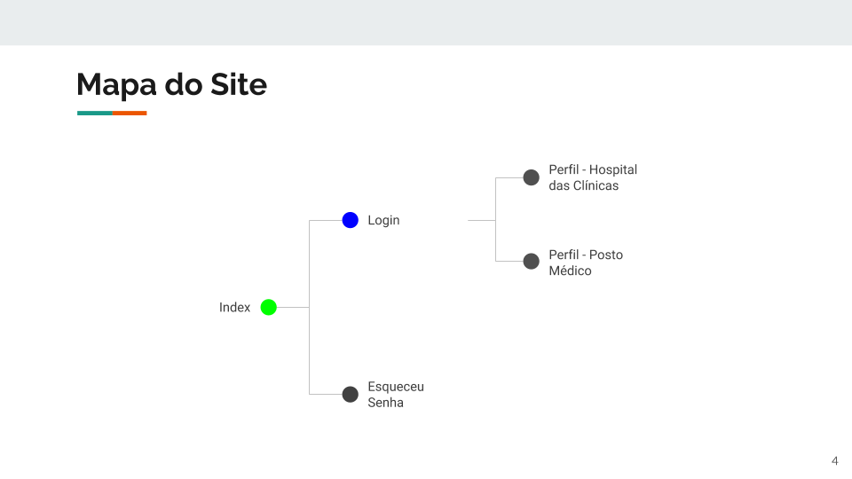
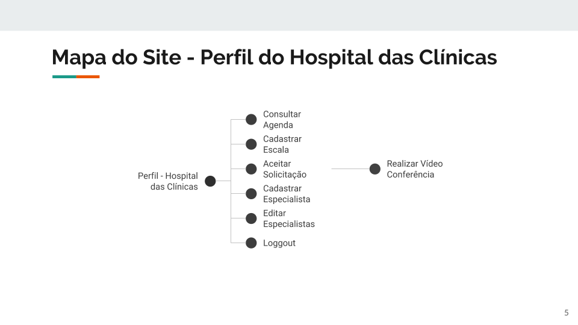
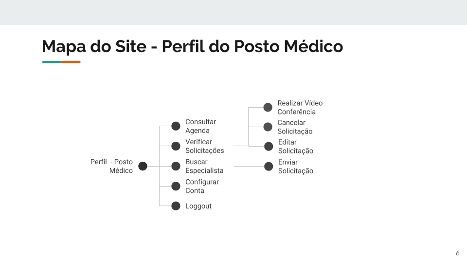
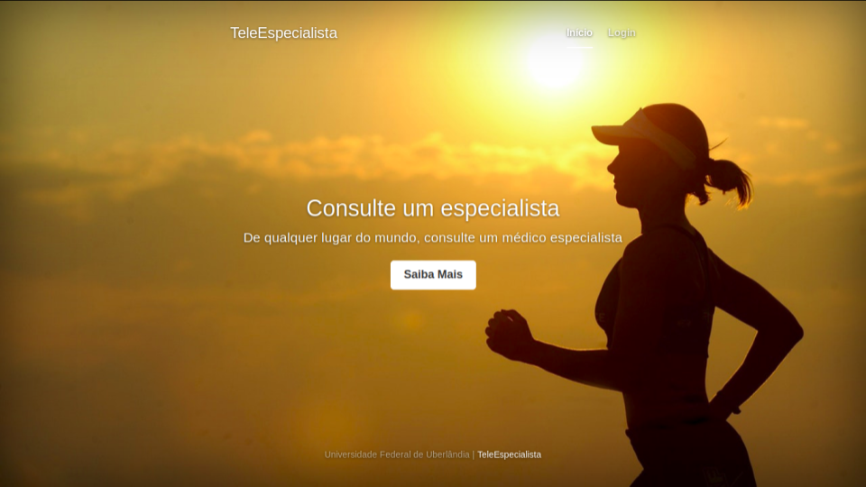

# TeleEspecialista - Sistema de agendamento e teleconsulta
Documentação do projeto de Telemedicina.
http://tele-especialista.sytes.net/

## Proposta do Sistema
**Sistema Atual**

**Nossa Proposta**

## Diagramas UML
**Use-Cases**

**Mapa do Site**

**Mapa do Site - Perfil do Hospital das Clínicas**

**Mapa do Site - Perfil do Posto Médico**

## Wireframe
**Index**

## Referências
* Diagramas UML:
    * Lucid Chart <https://www.lucidchart.com/pages/examples/uml_diagram_tool>
    * Plant UML<http://plantuml.com/>
    * DevMedica <https://www.devmedia.com.br/o-que-e-uml-e-diagramas-de-caso-de-uso-introducao-pratica-a-uml/23408>
* Wireframe:
    * Wikipedia <https://pt.wikipedia.org/wiki/Website_wireframe>
    * Minimal Wireframe Tool<https://wireframe.cc/>
* Desenvolvimento de uma tela (HTML, CSS, JavaScript):
    * W3 Schools <https://www.w3schools.com/>
    * Banco de dados  Firebase <https://youtu.be/-OKrloDzGpU>  
    * Bootstrap <https://startbootstrap.com/template-categories/all/>

## Autores

* Ítalo G. S. Fernandes
* Lucas L. Franco
* Mariane M. Oliveira
* Nathalia Rodrigues
* Paulo Camargos
