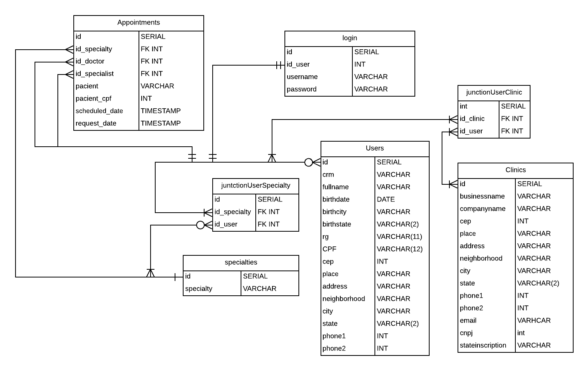

## Setting up the environmentLoginForm

1. Create a working directory
1. Install vitualenv:

    `$ pip install virtualenv`

1. Create a new virtualenv

    `$ virtualenv ven`

1. Activate the virtual environment

	`$ . activate`

1. When active, install these modules:
    - [Flask](http://flask.pocoo.org/)

    	`$ pip install Flask`

    - [WTForms](https://flask-wtf.readthedocs.io/en/stable/)

    	`$ pip install flask-wtf`

    - [SQLAlchemy](https://docs.sqlalchemy.org/en/latest/)

    	`$ pip install flask-sqlalchemy`

    - [Flask-login](https://flask-login.readthedocs.io/en/latest/)

    	`$ pip install flask-login`

    - [Bcrypt](https://pypi.org/project/bcrypt/)

    	`$ pip install flask-bcrypt`

    - [Psycopg2](http://initd.org/psycopg/)

        `$ pip install psycopg2-binary`

1. Start coding!

**Use-Cases**

